# SensorHub

## Introdução

O SensorHub é um projeto desenvolvido para a disciplina Tópicos em Dispositivos Móveis, dentro da proposta de criar um aplicativo usando o maior apoio possível de ferramentas de IA generativa.

A ideia do sistema é monitorar ambientes por meio de sensores IoT. O usuário pode cadastrar dispositivos, associar cada dispositivo a um ambiente e acompanhar dados como temperatura, umidade, última comunicação e histórico de medições.

## Apoio ao desenvolvimento com IA generativa

Este projeto foi desenvolvido com apoio de IA generativa, conforme a proposta da atividade da disciplina. A principal ferramenta utilizada foi o **Codex CLI**, executado no terminal dentro do repositório do projeto.

O desenvolvimento contou com um agente do Codex usando o modelo **GPT-5.5**. Majoritariamente, na maioria dos casos, foi utilizado o nível de raciocínio **high**, configuração escolhida para favorecer tarefas mais longas e encadeadas, como leitura do monorepo, escrita de especificações, implementação incremental, revisão de regras de negócio, refatorações e execução de testes.

O conceito central de desenvolvimento foi **spec-driven**. Antes de implementar as partes principais do sistema, foram criadas especificações funcionais e técnicas em `specs/`, descrevendo o comportamento esperado, contratos de dados, regras de negócio, estados de erro e critérios de aceite.

Na prática, o Codex CLI foi usado como um par de programação orientado por specs. As interações seguiram um ciclo recorrente:

1. Definir ou ajustar a regra em uma especificação.
2. Ler o código existente antes de alterar.
3. Implementar mudanças pequenas e verificáveis.
4. Rodar testes, formatação ou validações objetivas.
5. Revisar inconsistências e corrigir o comportamento.

A IA foi usada principalmente para:

- organizar as especificações do projeto;
- propor a arquitetura inicial;
- gerar partes do código;
- revisar regras de negócio;
- criar e ajustar testes;
- apoiar refatorações de nomes e estrutura;
- documentar comandos de execução;
- analisar inconsistências entre app mobile, API, ingestor e simulador.

Apesar do apoio da IA, houve intervenção manual constante para tomar decisões de produto, revisar as sugestões, validar comportamento, executar testes e ajustar regras quando surgiam inconsistências.

## Sobre o aplicativo

O aplicativo mobile do SensorHub foi construído em Flutter e consome uma API própria para exibir dados persistidos no PostgreSQL.

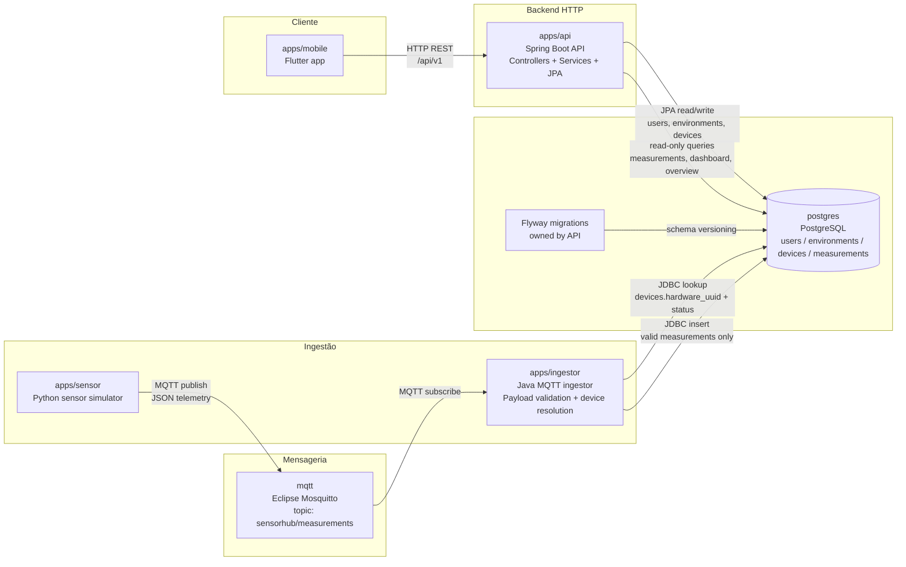

O fluxo previsto é:

1. Um sensor físico ou simulado publica uma leitura via MQTT.
2. O `ingestor` consome a mensagem, valida o payload e verifica o dispositivo no banco.
3. Leituras válidas de dispositivos ativos são persistidas no PostgreSQL.
4. A API consulta os dados persistidos e entrega informações ao app mobile.
5. O app exibe cards de sensores, detalhes, gráficos e estados como online, offline, sem dados ou inativo.

Na fase atual, o sensor físico é representado pelo módulo `apps/sensor`, um simulador em Python que mocka dados de temperatura e umidade e publica mensagens MQTT.

## Funcionalidades

- Cadastro e gerenciamento de dispositivos.
- Associação de dispositivos a ambientes.
- Listagem de ambientes.
- Dashboard mobile com leitura atual dos sensores.
- Tela de detalhe com temperatura, umidade, histórico e overview do período.
- Identificação visual de sensores sem dados, offline ou inativos.
- Inativação e reativação de sensores.
- Ingestão de medições via MQTT.
- Simulação local de sensores para desenvolvimento e testes.

## Tecnologias utilizadas

### Aplicativo mobile

- Flutter
- Dart

### API

- Java 25
- Spring Boot
- Spring Web MVC
- Spring Data JPA
- Flyway

### Ingestor

- Java 25
- Eclipse Paho MQTT client
- JDBC
- Jackson

### Sensor simulado

- Python
- paho-mqtt

### Infraestrutura e persistência

- PostgreSQL
- MQTT com Eclipse Mosquitto
- Docker Compose

## Estrutura do projeto

```text
SensorHub/
  apps/
    mobile/       Aplicativo Flutter
    api/          API Java/Spring Boot
    ingestor/     Ingestor Java para mensagens MQTT
    sensor/       Simulador Python de sensor
  infra/
    mosquitto/    Configuração do broker MQTT
  specs/          Especificações funcionais e técnicas
  docker-compose.yml
```

## Como executar

Suba os serviços principais a partir da raiz do repositório:

```bash
docker compose up --build -d
```

Alternativamente, usando Podman:

```bash
podman compose up --build -d
```

Serviços principais:

### Aplicações

| Serviço | Endereço local | Observações |
| --- | --- | --- |
| API | `http://localhost:8080` | Base HTTP da API Spring Boot. |
| Sensor simulado | Sem porta exposta | Publica leituras mockadas no tópico MQTT. |
| Ingestor | Sem porta exposta | Consome mensagens MQTT, valida o payload e persiste medições no PostgreSQL. |

### Infraestrutura

| Serviço | Porta/endpoint local | Observações |
| --- | --- | --- |
| PostgreSQL | `localhost:5432` | Banco `sensorhub`, usuário `sensorhub`, senha `sensorhub`. |
| Broker MQTT | `localhost:1883` | Porta TCP do Eclipse Mosquitto; tópico principal: `sensorhub/measurements`. |
| Broker MQTT WebSocket | `localhost:9001` | Porta WebSocket do Mosquitto para clientes compatíveis. |
| MQTT UI | `http://localhost:8081` | Interface web para acompanhar mensagens MQTT. |


## Executar o aplicativo mobile

Com a API em execução, rode o app Flutter no emulador Android:

```bash
cd apps/mobile
flutter run --dart-define=SENSORHUB_API_BASE_URL=http://10.0.2.2:8080
```

## Testes

Mobile:

```bash
cd apps/mobile
flutter test
```

Sensor simulado:

```bash
cd apps/sensor
python -m unittest discover -s tests
```

Ingestor:

```bash
cd apps/ingestor
mvn test
```

Quando o Maven não estiver instalado localmente, os testes do ingestor podem ser executados com container a partir da raiz do repositório:

```bash
podman run --rm -v "$PWD/apps/ingestor:/workspace:Z" -w /workspace maven:3.9-eclipse-temurin-25 mvn test
```

## Trabalhos futuros

### Consistência após inativação de sensores

Atualmente, quando um sensor é inativado, o app evita continuar atualizando automaticamente os dados desse sensor na tela de dashboard e na tela de detalhe. Porém, ainda existe uma questão de consistência entre o momento em que a API altera o status do dispositivo e o momento em que o `ingestor` passa a reconhecer essa alteração.

O `ingestor` usa cache para evitar consultar o PostgreSQL a cada mensagem MQTT recebida. Por isso, logo após a inativação de um sensor, pode existir uma pequena janela em que o sensor já aparece como inativo na API e no app, mas o `ingestor` ainda tem o status anterior em cache. Nesse intervalo, algumas leituras podem continuar sendo aceitas até o cache expirar.

Uma alternativa futura para reduzir essa janela seria usar **PostgreSQL `LISTEN/NOTIFY`**:

1. A API atualiza o status do dispositivo no PostgreSQL.
2. Após a alteração, a API emite um `NOTIFY` informando que o status daquele dispositivo mudou.
3. O `ingestor` mantém uma conexão ouvindo esse canal com `LISTEN`.
4. Ao receber a notificação, o `ingestor` invalida o cache daquele dispositivo.
5. Na próxima mensagem MQTT, o `ingestor` consulta novamente o banco e passa a usar o status atualizado.

Essa abordagem mantém o PostgreSQL como fonte da verdade e evita misturar eventos administrativos com o tópico MQTT de telemetria. O cache com TTL continua útil como fallback caso alguma notificação seja perdida ou o listener precise reconectar.

### Firmware para sensor físico

Outro trabalho futuro é substituir ou complementar o simulador Python por um sensor físico real.

A proposta inicial é criar um firmware ou script para rodar em uma **Raspberry Pi Zero 2 W** conectada a um sensor **DHT11**. Esse dispositivo deve:

- ler temperatura e umidade do DHT11;
- montar o payload JSON no mesmo contrato usado pelo simulador;
- publicar as leituras no broker MQTT no tópico `sensorhub/measurements`;
- usar um `hardwareUuid` configurável para identificar o dispositivo;
- tratar falhas de leitura do sensor físico;
- permitir configuração do host MQTT, intervalo de publicação e identificador do dispositivo.

Com isso, o fluxo deixaria de depender apenas de dados mockados e passaria a validar o caminho completo: sensor físico -> MQTT -> ingestor -> PostgreSQL -> API -> app mobile.

### Outras evoluções possíveis

- Adicionar autenticação e autorização na API.
- Melhorar o provisionamento de dispositivos.
- Adicionar alertas para temperatura ou umidade fora de faixa.
- Implementar notificações no app mobile.
- Criar uma tela de histórico tabular ou exportação de medições.

## Screenshots

### Fluxo do aplicativo mobile

A ordem abaixo apresenta primeiro a experiência principal do usuário: dashboard, gerenciamento de dispositivos e ambientes, formulários, detalhes do sensor e estados operacionais.

<p>
  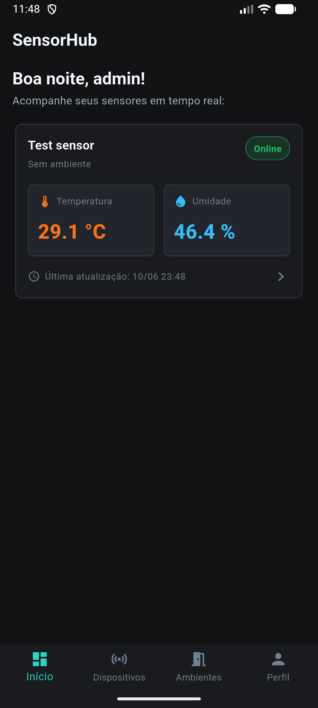
  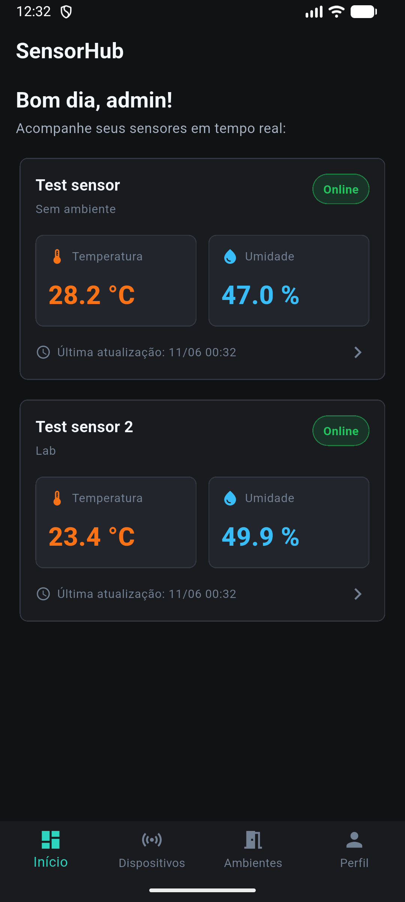
  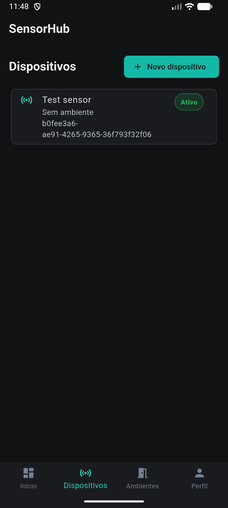
  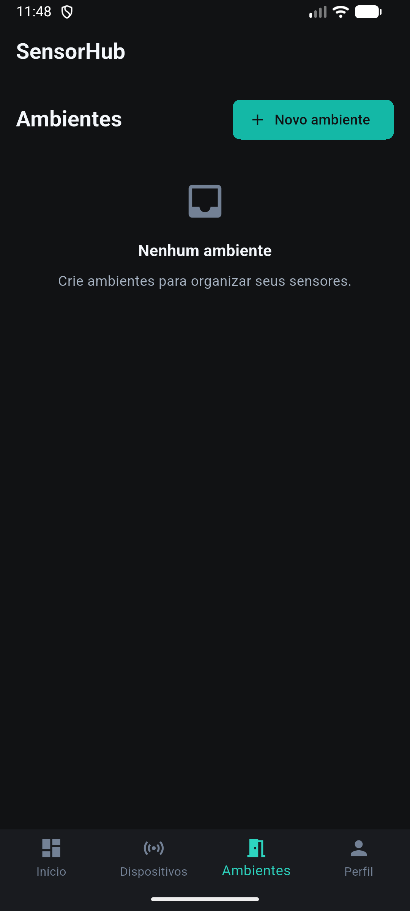
</p>

<p>
  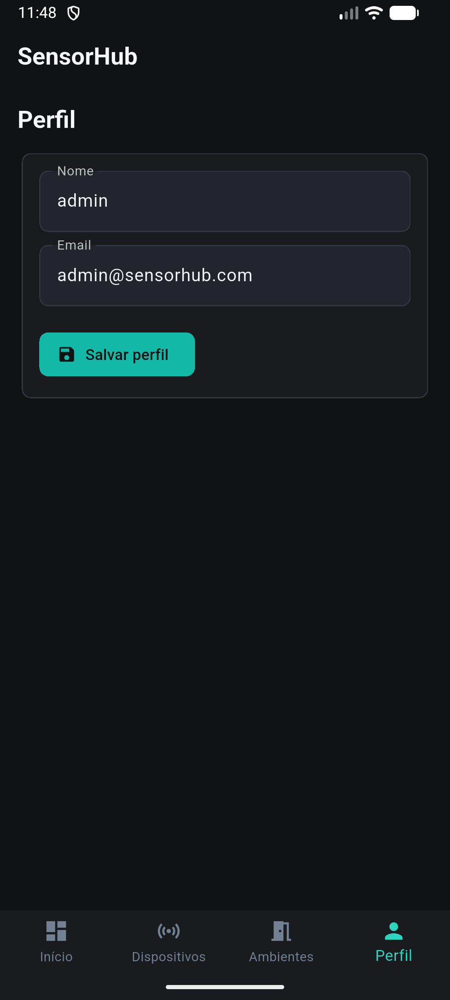
  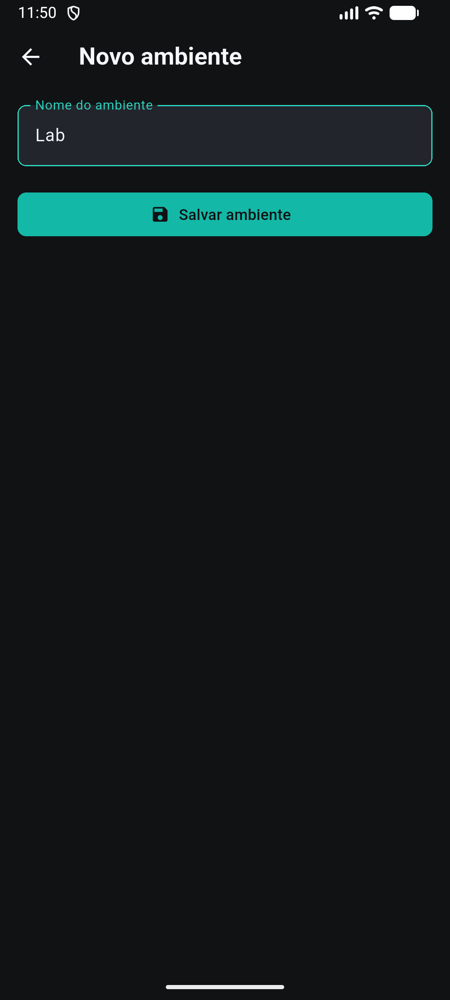
  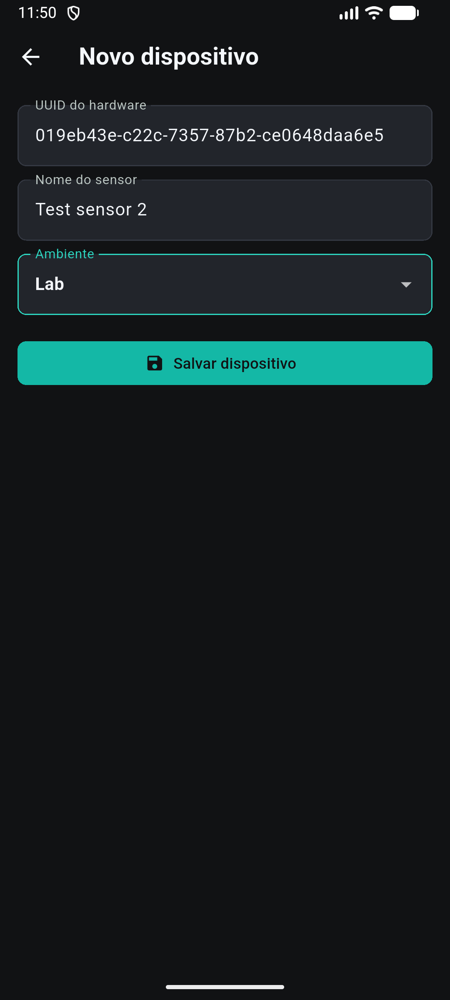
  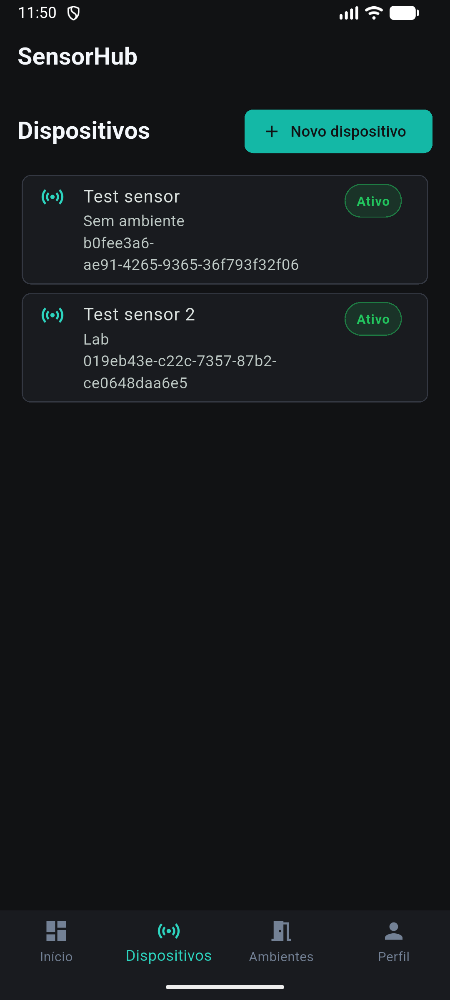
</p>

<p>
  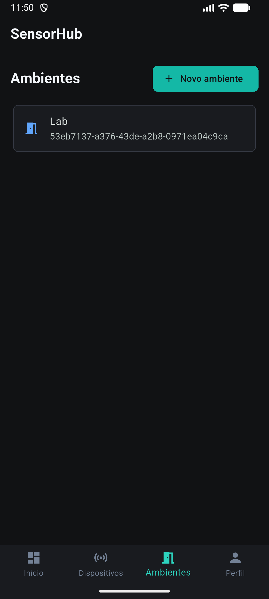
  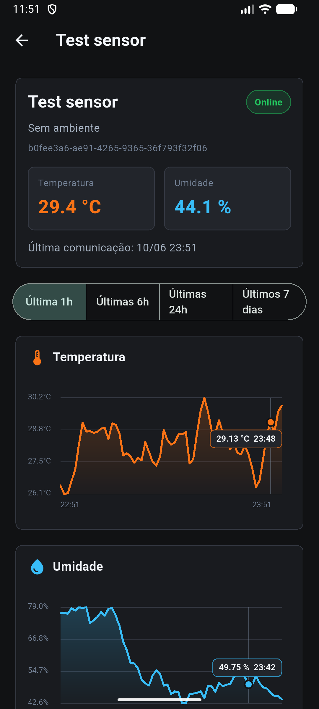
  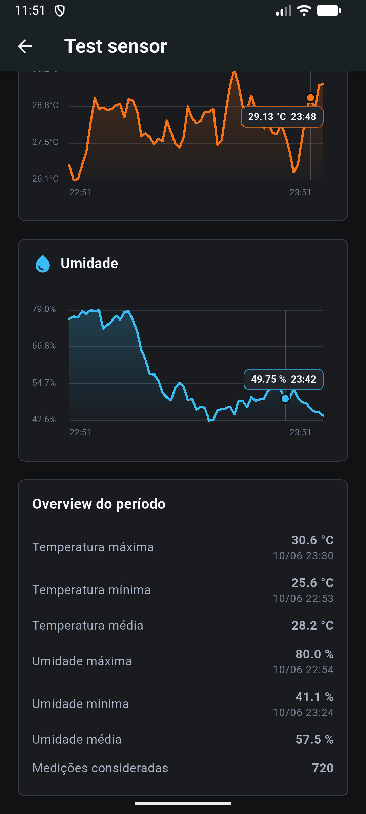
  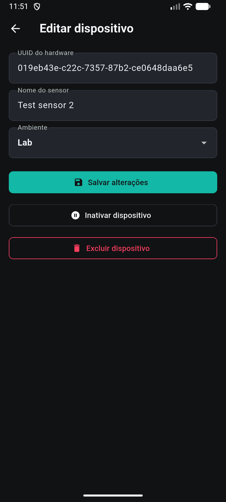
</p>

<p>
  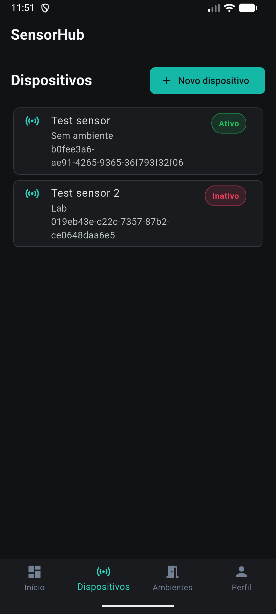
  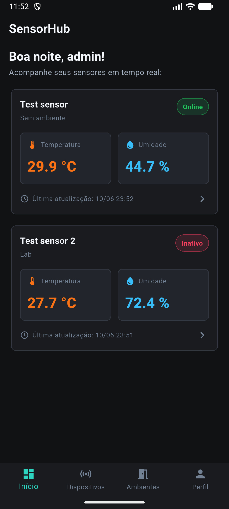
  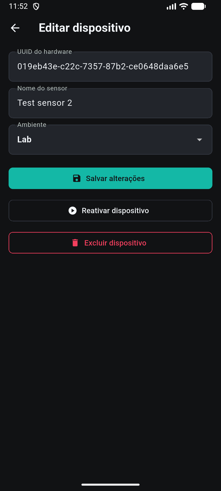
  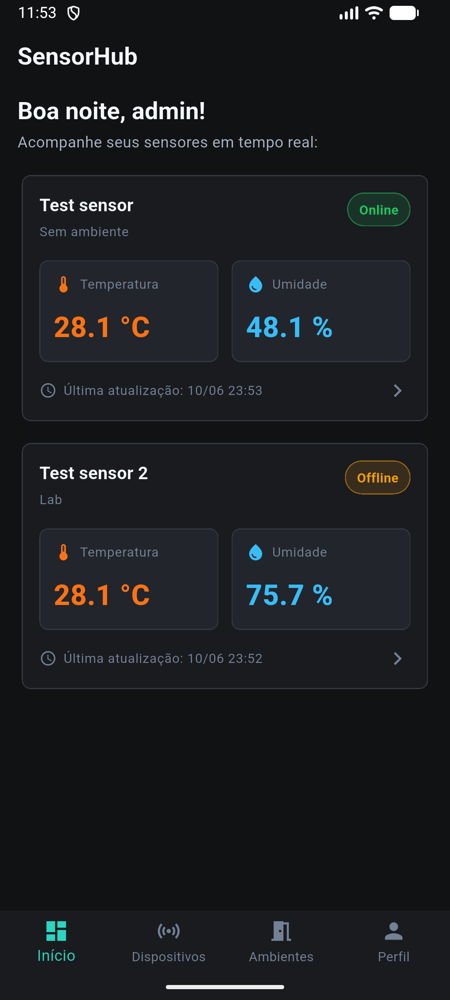
</p>

### Infraestrutura e persistência

As capturas abaixo focam nos dados do fluxo: mensagens de telemetria chegando pelo MQTT UI e medições persistidas no PostgreSQL visualizadas pelo DBeaver.

<p>
  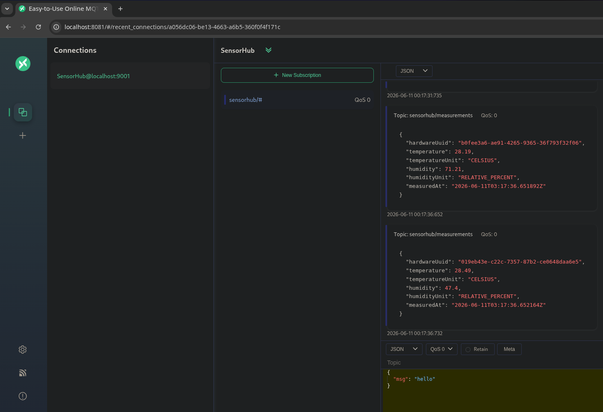
  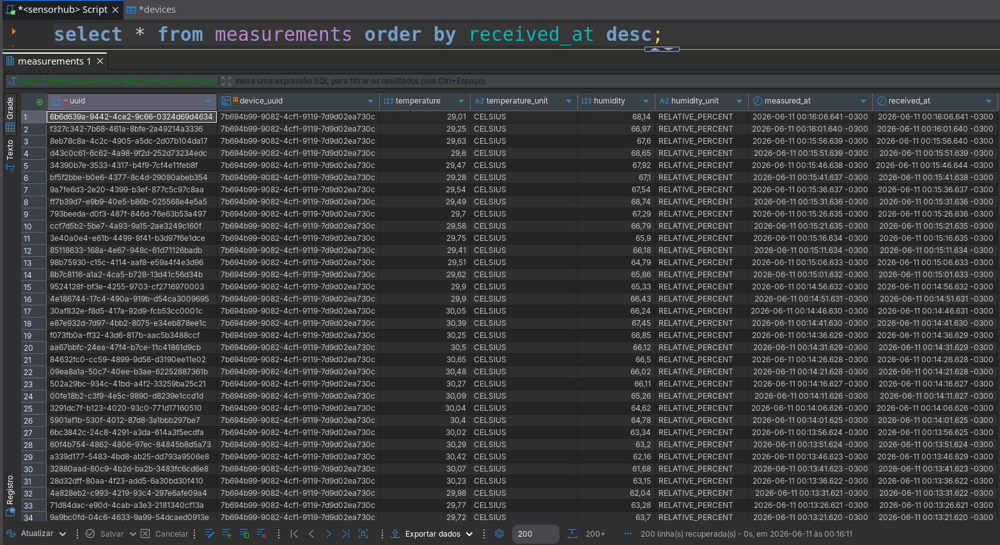
</p>

## Especificações

As principais decisões funcionais e técnicas estão documentadas em `specs/`:

- `001-product-overview.md`
- `002-api.md`
- `003-sensor.md`
- `004-mobile-application.md`
- `005-ingestor.md`
